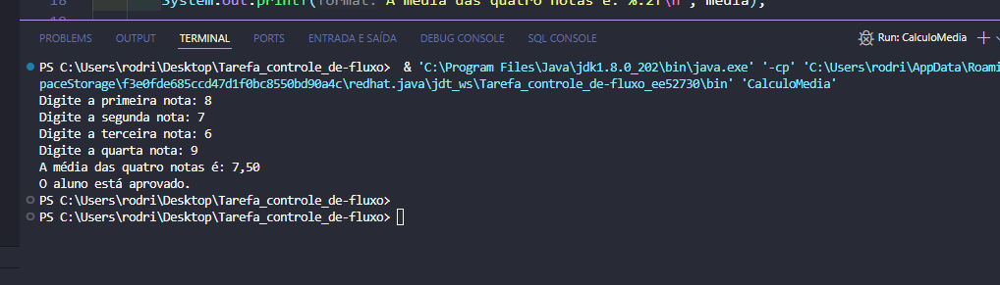
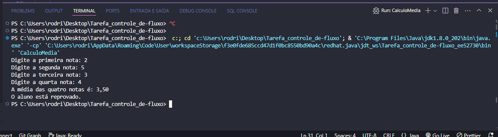
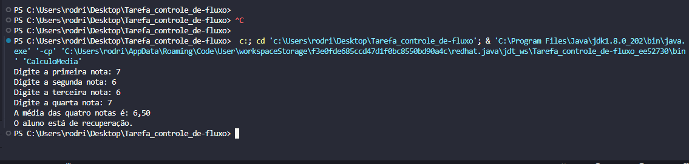

<!DOCTYPE html>
<html lang="pt-br">
<head>
    <meta charset="UTF-8">
    <meta name="viewport" content="width=device-width, initial-scale=1.0">
    <meta name="description" content="Projeto em Java para calcular a média de quatro notas e determinar a situação do aluno.">
    <meta name="keywords" content="Java, cálculo de média, notas, aprovação, recuperação, reprovação">
    <meta name="author" content="Ana Alice Rodrigues">

</head>
<body>

<header>
    <h1>Cálculo de Média e Situação do Aluno</h1>
    
    
    
</header>

    
Índice

    <ol>
        <li><a href="#sobre-o-projeto">Sobre o projeto</a></li>
        <li><a href="#parte-tecnica">Parte Técnica</a></li>
        <li><a href="#estrutura-dos-arquivos">Estrutura dos Arquivos</a></li>
        <li><a href="#casos-de-uso">Casos de Uso</a></li>
        <li><a href="#ferramentas">Ferramentas</a></li>
        <li><a href="#contato">Contato</a></li>
    </ol>

<section id="sobre-o-projeto">
    <h2>Sobre o projeto</h2>
    

        Este projeto em Java calcula a média de quatro notas de um aluno e determina se o aluno está aprovado, em recuperação ou reprovado. O programa permite ao usuário realizar múltiplos testes de média através do terminal.
    

    

        Proposta de Valor: Fornecer uma maneira simples e eficiente para calcular a média das notas dos alunos e determinar sua situação acadêmica, ajudando no acompanhamento do desempenho escolar.
    

</section>

<section id="parte-tecnica">
    <h2>Parte Técnica</h2>
    <ul>
        <li> Linguagem de Programação: Java</li>
        <li> Ferramenta de Entrada: Scanner (para entrada de dados do usuário via terminal)</li>
    </ul>
</section>

<section id="estrutura-dos-arquivos">
    <h2>Estrutura dos Arquivos</h2>
    <ul>
        <li>
            <strong>CalculoMedia.java:</strong>
            
Este arquivo contém o código fonte que realiza o cálculo da média das notas e determina a situação do aluno.

        </li>
    </ul>
</section>

<section id="casos-de-uso">
    <h2>Casos de Uso</h2>
    <ul>
        <li> Entrada de quatro notas pelo usuário e cálculo da média dessas notas.</li>
        <li> Determinação da situação do aluno (aprovado, recuperação, reprovado) com base na média calculada.</li>
    </ul>
</section>

<section id="ferramentas">
    <h2>Ferramentas</h2>
    <ul>
        <li></li>
        <li></li>
    </ul>
</section>

<section id="contato">
    <h2>Contato</h2>
    <ul>
        <li></li>
    </ul>

</section>

</body>
</html>

